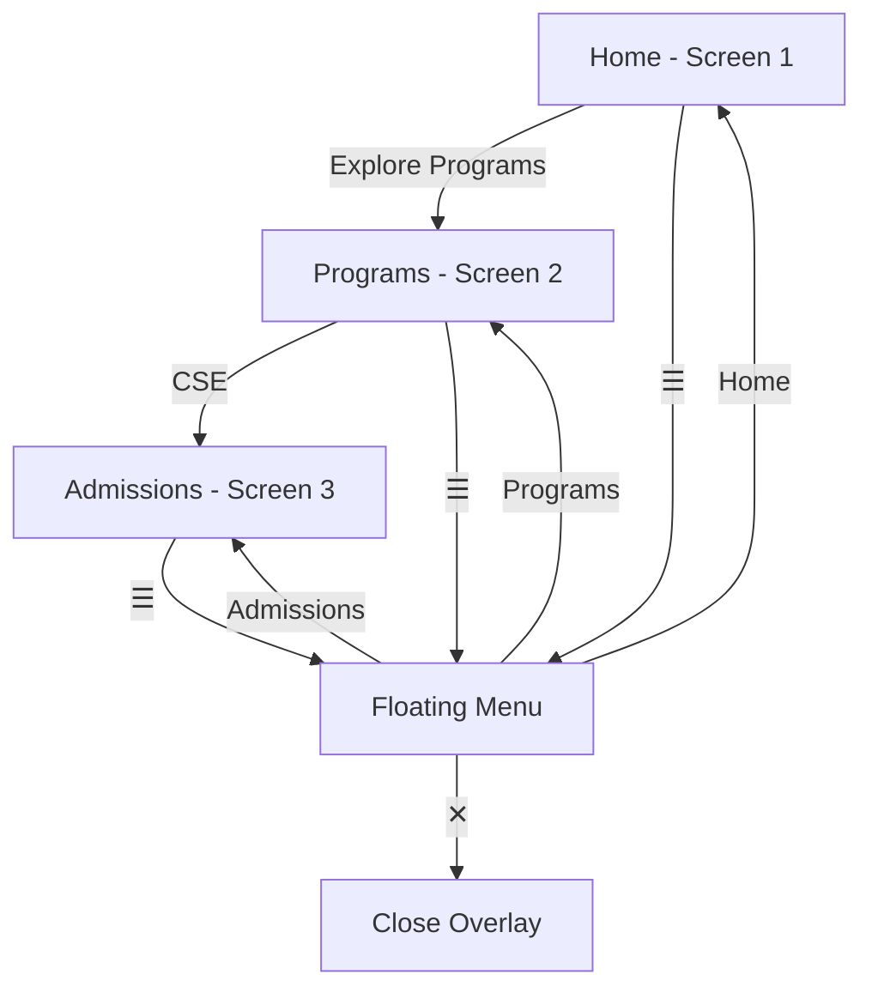

# interactive-ui-prototype
# CMREC Interactive Prototype

## 📱 Project Overview

An interactive mobile prototype created for the **CMREC College Website Redesign** as part of **Task 3 — Interactive Prototype Creation**.

The prototype converts the previously designed mobile UI screens into a clickable experience with navigation flows, transitions, and a floating hamburger menu.

## 🎯 Objective

The objective of this task is to create a clickable prototype that simulates real website interactions and demonstrates how users can navigate through the redesigned CMREC mobile website.

## ✨ Key Interactions

* 🏠 Home → Programs navigation
* 📚 Programs → Admissions navigation
* ☰ Floating hamburger menu
* 🏠 Home, 📚 Programs and 🎓 Admissions navigation from the menu
* ✕ Close overlay interaction
* Smooth screen transitions and animations
* Interactive navigation between the three main mobile screens

## 🔄 Prototype Flow

## 🔗 Interactive Figma Prototype

[**View Interactive Prototype →**](https://www.figma.com/proto/pHlh2Fso3UgP8B3Z2F8oeF/website-ui-redesign?node-id=19-591&p=f&t=znxsWovu6qsnVz5z-1&scaling=scale-down&content-scaling=fixed&page-id=17%3A426&starting-point-node-id=18%3A432)

The prototype can be explored in Present mode to experience the navigation and interactive menu.

## 🧪 User Testing & Feedback

A quick usability evaluation was performed to review:

* Navigation clarity
* Discoverability of important sections
* Hamburger menu usability
* Overlay behavior
* Ease of moving between Home, Programs and Admissions

The evaluation identified usability observations and areas for future refinement.

📄 [**View User Testing & Feedback Report →**](Interactive_Prototype_User_Testing_Feedback.pdf)

## 🛠️ Tools Used

* **Figma** — UI design and interactive prototyping
* **GitHub** — Project documentation and submission

## 📱 Screens Included

The prototype contains three main mobile screens:

1. **Home**
2. **Programs**
3. **Admissions**

These screens are connected through interactive navigation and a reusable floating hamburger menu.

## 🎓 Task Information

**Task:** Task 3 — Interactive Prototype Creation

**Project:** CMREC College Website Redesign

**Focus:** Interactive navigation, transitions, prototype testing and usability evaluation.

## ✅ Expected Outcome

Create and evaluate a clickable mobile prototype that demonstrates real website interactions and improves the presentation and usability of the redesigned CMREC website.

